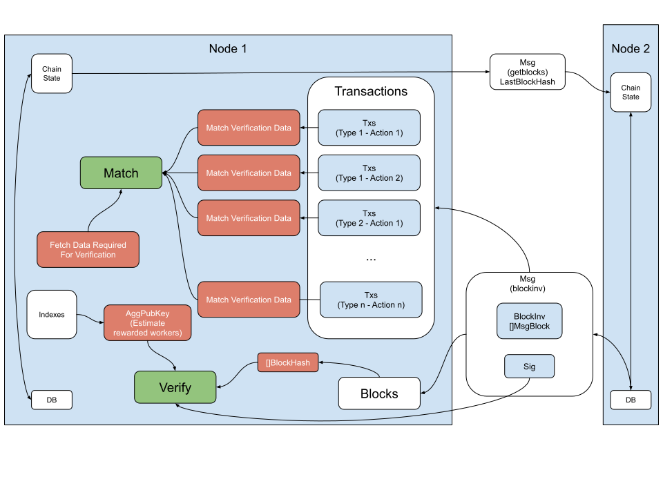

Chain Sync verification flow
--------------

### Block Inventory elements definition

 Name | Type 
---|---
 [BlockInv](#blockinv) | []MsgBlock 
 [Sig](#sig) | [96]byte  

#### BlockInv

The BlockInv is an array of block elements.

#### Sig

The Sig is a BLS12-381 serialized aggregated signature produced by aggregating all the block signatures.

### Verification

