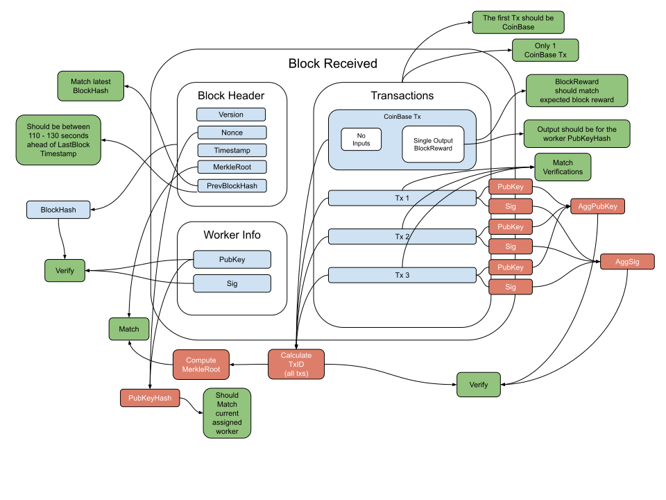

New block verification flow
--------------

### Block elements definitions

Name | Type 
--- | --- 
[BlockHeader](#blockheader) | OutPoint 
[Txs](#txs) | []Txs 
[PubKey](#pubkey) | [48]byte 
[Sig](#sig) | [96]byte 

#### BlockHeader

The BlockHeader is the main identifier for the block. The BlockHeader contains: 
* The block Version
* The block Timestamp
* The block Nonce
* The Previous block hash
* The Transactions MerkleRoot.

#### Txs

The Txs an array of transactions.

#### PubKey

The PubKey is a BLS12-381 serialized public key of the assigned worker that creates the block.

#### Sig

The Sig is a BLS12-381 serialized signature created using the private key of the assigned worker and the BlockHeaderHash as the message.

### Verification

