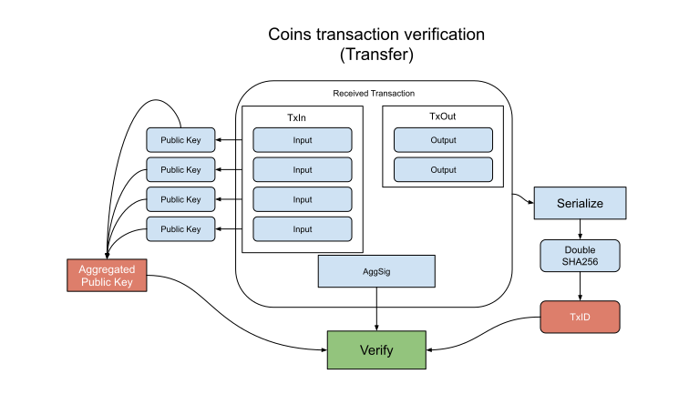

Coins (Transfers) Verification Flow
--------------

### Payload elements definitions

 Name | Type 
---|---
 [AggSig](#aggsig) | [96]byte 
 [TxIn](#txin) | []Inputs 
 [TxOut](#txout) | []Outputs  
 
#### AggSig

The AggSig is a BLS12-381 serialized aggregated signature. It is created by signing the inputs on the transaction and aggregating all the signatures into a single one.

#### TxIn

The TxIn element is an array of Inputs.

Each input is a reference to a utxo that is being spent on the transaction, the public key that holds the utxo ownership, and a signature that is created using the Private Key and using the TxID as the message.

#### TxOut

The TxOut element is an array of Outputs.

Each output is a reference to the new coin owner. It consists of a value and a Public Key Hash for new coin ownership.

### Verification

