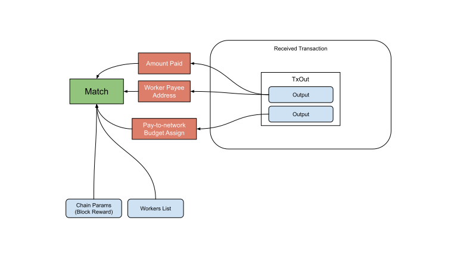

Coins (Create) Verification Flow
--------------

### Payload elements definitions

 Name | Type 
---|---
 [TxOut](#txout) | []Outputs  
 
#### TxOut
 
The TxOut element is an array of Outputs.
 
Each output is a reference to the new coin owner. It consists of a value and a Public Key Hash for new coin ownership.
 
 
### Verification

