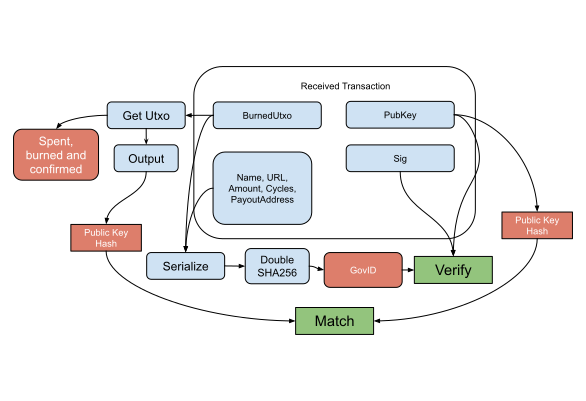

Governance (Create) Verification Flow
--------------

### Payload elements definitions

Name | Type 
--- | --- 
[BurnedUtxo](#burnedutxo) | OutPoint 
[PubKey](#pubkey) | [48]byte 
[Sig](#sig) | [96]byte 
[Name](#name) | string 
[URL](#url) | string 
[PayoutAddress](#payoutaddress) | string 
[Amount](#amount) | int64 
[Cycles](#cycles) | int32 

#### BurnedUtxo

The BurnedUtxo is the reference of the transaction that send a specific amount of coins to a non-recoverable address.

#### PubKey

The PubKey is the BLS12-381 serialized public key of the address that burned the coins.

#### Sig

The Sig is the BLS12-381 serialized signature using the private key of the address that burned the coin and the calculated GovID as message.

#### Name

The Name is the selected name for the proposal.

#### URL

The URL is a link to find more information about the proposal.

#### PayoutAddress

The PayoutAddress public key hash of an address that receives the coins if the proposal is payed.

#### Amount

The Amount is the total amount of coins to receive for the proposal.

#### Cycles

The Cycles is the amount of times the proposal will get payed.

### Verification

