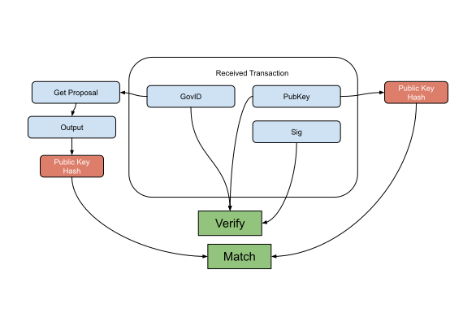

Governance (Delete) Verification Flow
--------------

### Payload elements definitions

Name | Type 
--- | --- 
[GovID](#govid) | []byte 
[PubKey](#pubkey) | [48]byte 
[Sig](#sig) | [96]byte 

#### GovID

The GovID is the bytes representation from the hash of the governance proposal that is being removed.

#### PubKey

The PublicKey is a BLS12-381 serialized public key of the address that burned the coins as collateral for submitting the governance proposal.

#### Sig

The Sig is a BLS12-381 serialized signature that uses the Private Key of the address that burned the coins and the GovID as the message.

### Verification

