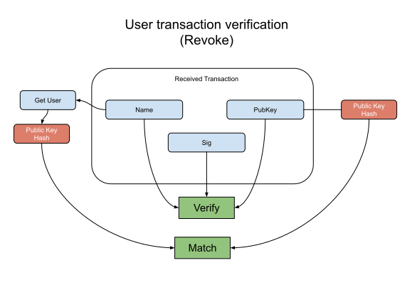

User (Update) Verification Flow
--------------

### Payload elements definitions

Name | Type 
--- | --- 
[Sig](#sig) | [96]byte 
[Name](#name) | string 

#### Sig

The Sig is the BLS12-381 serialized signature created with the Private Key of the user's public key and the names as the message.

#### Name

The Name is the user identifier.

### Verification

