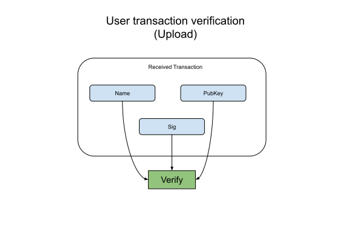

User (Upload) Verification Flow
--------------

### Payload elements definitions

Name | Type 
--- | --- 
[PubKey](#pubkey) | [48]byte
[Sig](#sig) | [96]byte 
[Name](#name) | string 

#### PubKey

The PubKey is the BLS12-381 serialized public key that relates to the user name.

#### Sig

The Sig is the BLS12-381 serialized signature created from the private key and the user name as the message.

#### Name

The Name is the user identifier.

### Verification

