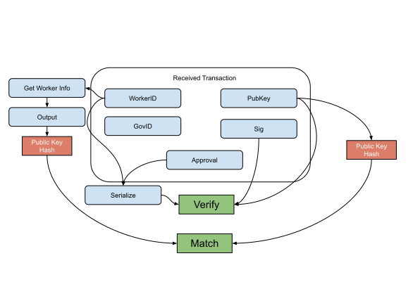

Vote (Upload/Update) Verification Flow
--------------

### Payload elements definitions

Name | Type 
--- | --- 
[WorkerID](#workerid) | OutPoint
[PubKey](#pubkey) | [48]byte 
[Sig](#sig) | [96]byte 
[GovID](#govid) | []byte 
[Approval](#approval) | bool 

#### WorkerID

The WorkerID is the OutPoint of the utxo used to add the worker to the list.

#### PubKey

The PubKey is the BLS12-381 serialized public key that holds the utxo of the WorkerID.

#### Sig

The Sig is the BLS12-381 serialized signature created from the private key of the utxo that generates the WorkerID using the WorkerID as the message.

#### GovID

The GovID is the byte representation of the hash for governance proposal identifier.

#### Approval

The Approval is a boolean to determine if the vote is to fund it or not.

### Verification

