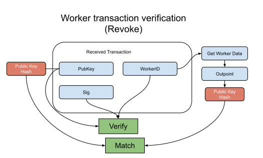

Worker (Revoke) Verification Flow
--------------

### Payload elements definitions

Name | Type 
--- | --- 
[PubKey](#pubkey) | [48]byte 
[Sig](#sig) | [96]byte 
[WorkerID](#workerid) | OutPoint 

#### PubKey

The PubKey is the BLS12-381 serialized public key that holds the utxo from the WorkerID.

#### Sig

The Sig is the BLS12-381 serialized signature created from the public key of the utxo that generates the WorkerID using the WorkerID as the message.

#### WorkerID

The WorkerID is the OutPoint of the utxo used to add the worker to the list.

### Verification

