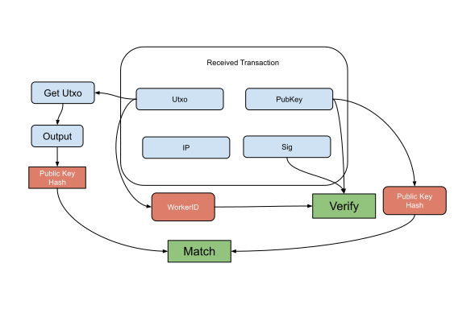

Worker (Upload/Update) Verification Flow
--------------

### Payload elements definitions

Name | Type 
--- | --- 
[Utxo](#utxo) | OutPoint 
[PubKey](#pubkey) | [48]byte 
[Sig](#sig) | [96]byte 
[IP](#ip) | string 

#### Utxo

The Utxo is the OutPoint that holds the collateral and used to determine the WorkerID.

#### PubKey

The PubKey is the BLS12-381 serialized public key that holds the utxo

#### Sig

The Sig is the BLS12-381 serialized signature created from the private key of the utxo using the serialized utxo as the message.

#### IP

The IP is the external identifier for the worker.

### Verification

